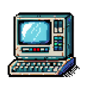

  
   
  <h1>8 bit computer emulator</h1> 

 
A experiment into creating a virtual 8 bit computer written in python, aided in implementation by chatGPT.

## (Planned) Specifications

- Z80-compatible CPU (supporting all documented and undocumented opcodes)
- 160x144 virtual screen resolution (20x18 characters text mode)
- 64K address total space (32K program ROM, 16K RAM, 8K Video RAM, 4K character ROM (1K built-in, 3K extendable), 4K reserved)
- Keyboard support

## Other plans
- Look into interfacing "External storage" (virtual disk files)
- Sound?
